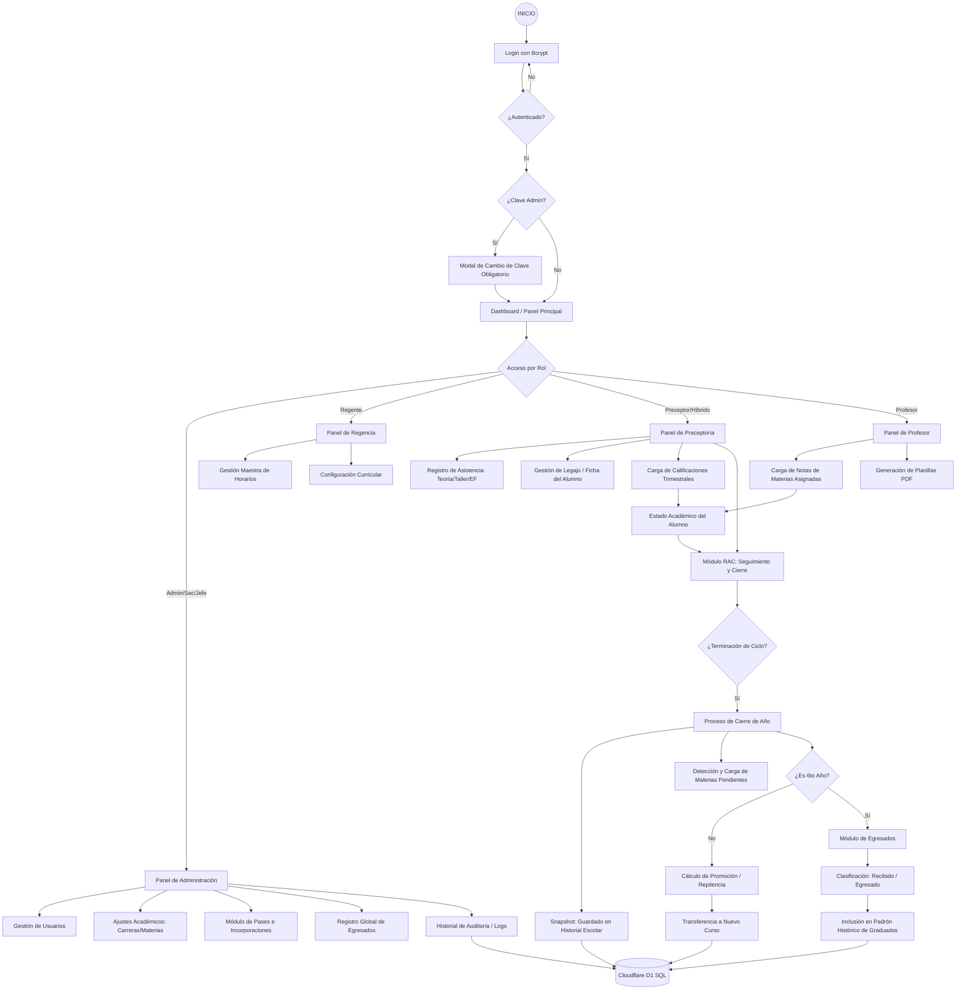
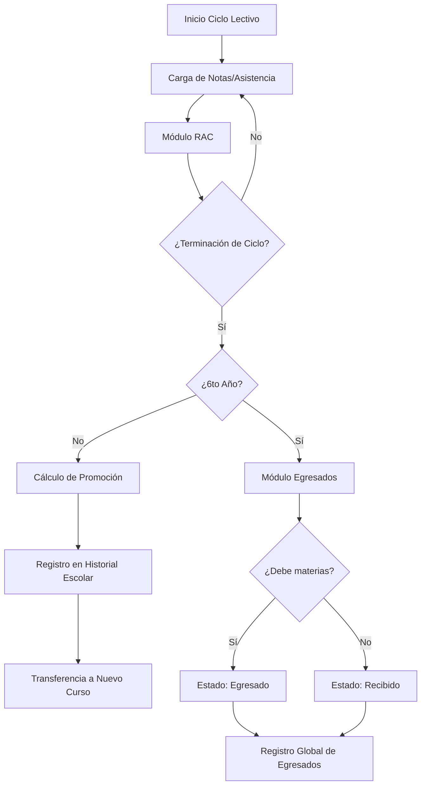

# 🗺️ Diagramas de Flujo del Sistema - Industrial Nº6

Este documento contiene la arquitectura lógica y el flujo de datos del sistema. 

> **Nota**: Este archivo utiliza el formato [Mermaid](https://mermaid.js.org/). Puedes visualizarlo directamente en GitHub o usando una extensión de Markdown en tu editor.

---

## 1. Diagrama de Flujo Maestro (End-to-End)

---

## 2. Ciclo de Vida del Alumno (Cierre de Ciclo)

---

## 3. Matriz de Responsabilidades

| Rol | Punto de Entrada | Responsabilidad Principal |
| :--- | :--- | :--- |
| **Admin / Sec. Alumnos** | Ajustes / Egresados | Gestión global, usuarios y registro de egresados. |
| **Regente de Profesores** | Horarios / Materias | Configuración de la estructura académica y cronogramas. |
| **Preceptor (Teoría/Taller/EF)**| Asistencia / RAC | Gestión diaria de alumnos y cierre de actas (RAC). |
| **Profesor** | Notas | Evaluación de materias asignadas y reportes de notas. |
| **Profesor Híbrido** | Panel Preceptor | Funciones de docente con privilegios de preceptoría. |

---

## 4. Respaldo Automático (G:\)
Cada vez que se ejecuta `npm run backup`, el sistema realiza:
1. Compresión del código (excluyendo `node_modules`).
2. Sincronización inmediata con `G:\Mi unidad\Escuela\Respaldo_Colegio.zip`.
